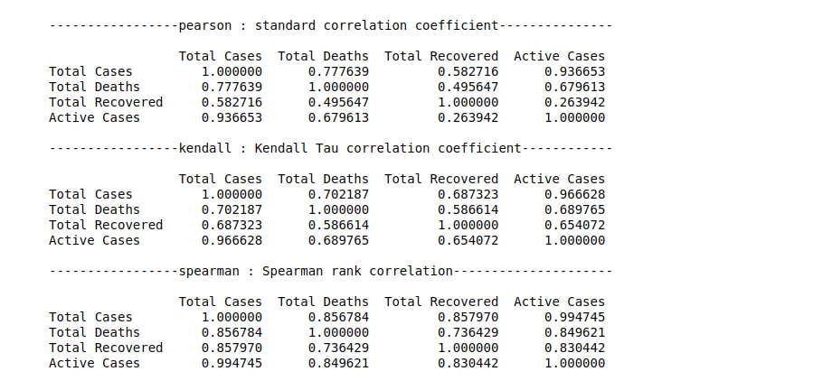
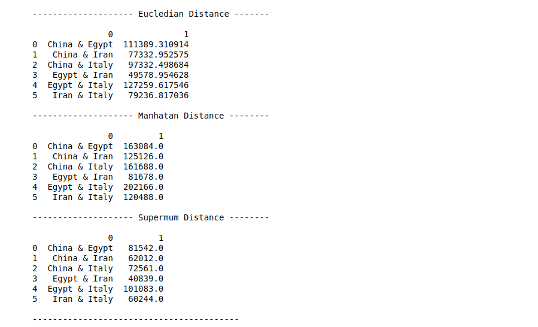
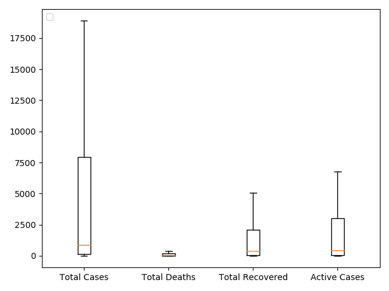

# Data

Our [data](https://github.com/CSSEGISandData/COVID-19) is from Johns Hopkins university, and it's daily updated
### Some modifications we made on the data are :
- removing province/state columns
- grouping states by countries and sum thier values
- extract last day data from each data set to create summary dataset
- using datasets to create new datasets for new daily cases

---

---

# Correlation of Data
- using different correlation methods we calculated the following correlations between data

## 

---

# Similarity and Dissimilarity of Data
- using different distance methods we calculated the following distances between the data

## 

---

# Skewness of Data

## 1- Calculating the skewness of Total Deaths for all the countries with **Rapidminer**

by plotting the number of death cases on the x axis and number of countries have the same number of cases on the y axis.


We can see that the data is positively skewed, which means that the majority of the countries have few dead cases
</br></br>

## 2- Calculating Skewness of Total Confirmed, Recovered, Deaths & Active Cases Data using **Python**


We can see that also (Total cases, Recovered cases, Active cases ) data is positivley skewed

---

---

# Progress of Infection

- Visualizing China's, Italy's, Iran's, Spain's & USA's Confirmed Cases Progress
  

---

---

# Data Boxplots
- drawing boxplots for confirmed, death, recoverd and active cases gave the follwing charts

## 

---

# Prediction

---

Tried to predict the expected number of COVID-19 ( confirmed - deaths - recovered ) cases in Egypt with two approches.

- Exponential curve equation</br>
- Logistic curve equation

The day which we will predict the number of cases on is May 25 2020.

Tools : R lang

## 1- Exponential curve fit

Here is the confirmed cases growth curve in Egypt


We can see by just looking that the growth of number of cases in Egypt is an expoential grwoth. so we can try to find the closest exponential curve that fits into this curve and find what number will be on that curve on May 25.

Using exponential growth equation **alpha * exp(beta * t) + theta** and R model to find the optimal alpha, beta and theta to find the closest curve fits into the growth curve of Egypt.

```
#Fitting a model to find the optimum value of theta
  model.0 <- lm(log(Cases - c.0) ~ Date, data = df_t)

  # Finding optimum of alpha, beta and theta
  start <-
    list(a = exp(coef(model.0)[1]),
         b = coef(model.0)[2],
         c = c.0)
  model = nls(
    formula = Cases ~ a * exp(b * Date) + c ,
    data = df_t,
    start = start
  )

  # Storing alpha, beta and theta
  t = coef(model)

  p = t["a"] * (exp(t["b"] * x)) + t["c"]
```

The expected confirmed cases number on May 25 is about **21,000 case**

## 

By trying the same on (death - recovered ) cases ...

the expected deaths cases number on May 25 is about **1000 cases**

## 

the expected recovered cases number on May 25 is about **4,500 cases**

## 

</br>
<hr>
</br>

## 2- Logistic curve equation

But there is no continuous exponential growth in real life, because eventualy we will reach a point where there will be so many infected people and less not infected people and the curve will start to slow until it falts when we reach the population,and here comes the logistic curve.


Logistic curve equation is **N(d+1) = E * P * N(d)** where ...</br>

- **N(d+1)** : Number of cases in the next day </br>
- **E** : Average number of people someone infectedd is exposed to every day</br>
- **P = (1 - N(d) / Population)**: Probabilty of each exposure becoming an infection </br>
- **N(d)** : Number of cases in the current day</br>

and we can see the logistic curve depends mostly on the **E** and **P** which together they represent the **infection rate**, in the begining of the infection the **P** is high becuase (1- (1 / 98 420 000) ) = 0.9999</br>
We can run something like a simulation by adjusting the **E** and **P**.

So by starting from the current dat and by saying that the average number of people someone infected is exposed to every day is 7 we find that the number of confirmed cases on May 25 is about **25,000 cases**
and if it's 4 because of the quarntine the number is about \*_15,000_


But by starting from the begining of the infection and by saying that the average number of people someone infected is exposed to each day is 7 before the quarntine and 2 after the quarntine.
The number of Actual cases on May 25 is about **150,000 cases**


---

# Attributes Generation

---

---

# Discretization

The data has no missing values, instead it's replaced with zeroes so we don't to worry about that.</br>
We discretize the Active Cases for the countries as follows : 
| cases | state |
| ----- | ----- |
| 0 -2000 | low |
| 2000 - 9000 | medium |
| 9000 - maximum number of Active cases | high 


---

---

# Text to Numerical

---

---

# Tracking Idea

---

---

# Decision Tree

---

---

# Naive Bayes Classification

---

---

# K-Means Clustering
1 - K-Means using RapidMiner 
-  Clustering the countries based on ( Total Cases - Total Deaths - Total Recovered - Active Cases ) for each country 
-  Number of cluster is 3  

The means for each cluster


Number of countries in each cluster 


Number of countries rows which belongs to cluster 0 


Plotting the clusters


</br>
</br> 

2- Using R language 
-  Clustering the countries based on ( Total Cases - Total Deaths - Total Recovered - Active Cases ) for each country 
-  Number of cluster is 3  
```
#scaling the data
df = scale(data[,2:ncol(data)])

rownames(df) = data$Country

#Setting the number of clusters to 3 
km.res = kmeans(df ,centers = 3 , nstart = 15)

#aggregate the data by the cluster number
aggregate(data, by=list(cluster=km.res$cluster), mean)
dd = cbind(data , cluster = km.res$cluster)

#print number of countries in each cluster 
print(table(unlist(dd$cluster)))

#visualize the clusters
fviz_cluster(km.res ,df)

```
| cluster | number of countries |
| ------- | ------------------- |
| 1 | 176 |
| 2 | 1   |
| 3 | 10  |


But we can clearly see that US is affecting the clustering because it's very high numbers so it's taking a cluster for itself 

So we can try to remove it from the data and recluster the countries 
```
data = data %>% filter(Country != "US")

```
| cluster | number of countries |
| ------- | ------------------- |
| 1 | 176 |
| 2 | 6   |
| 3 | 4 | 


